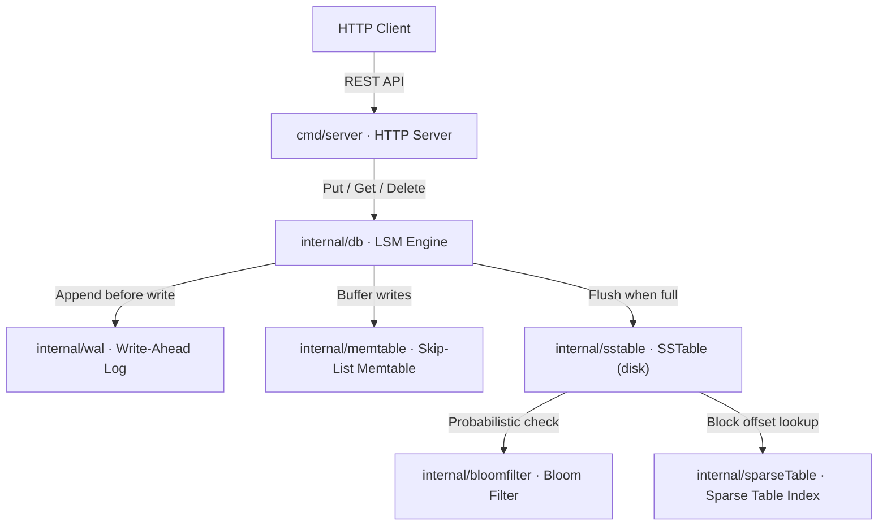

# keyradb

A persistent, LSM-tree-based key-value storage engine written in Go.

`keyradb` is built from scratch to demonstrate a production-grade Log-Structured Merge-tree (LSM tree) — the same foundational architecture used in RocksDB, LevelDB, and Apache Cassandra. The codebase is intentionally modular: each internal component is a standalone, testable package with a single responsibility.

## Architecture



## Package Layout

```
keyradb/
├── cmd/
│   └── server/          # HTTP server entrypoint
├── internal/
│   ├── db/              # LSM engine — orchestrates all components
│   ├── memtable/        # In-memory sorted write buffer (skip-list)
│   ├── sstable/         # Immutable on-disk sorted string table
│   ├── wal/             # Append-only write-ahead log
│   ├── bloomfilter/     # Probabilistic membership filter
│   └── sparseTable/     # Block-level sparse index
└── go.mod
```

## Write Path

```
PUT "k" → WAL.Append → Memtable.Put → [size ≥ threshold?] → flushLocked → SSTable
```

## Read Path

```
GET "k" → Memtable.Get → immutables (newest→oldest) → SSTables (newest→oldest)
```

## Quick Start

```bash
# Run the server
go run ./cmd/server/ -addr :6380 -data ./data -mem-mb 4

# PUT
curl -X PUT http://localhost:6380/keys/hello \
     -H "Content-Type: application/json" \
     -d '{"value":"world"}'

# GET
curl http://localhost:6380/keys/hello

# DELETE
curl -X DELETE http://localhost:6380/keys/hello
```

## Running Tests

```bash
go test -v ./...
```

## Component READMEs

- [`cmd`](cmd/README.md) — Main applications
- [`cmd/server`](cmd/server/README.md) — HTTP Server
- [`internal`](internal/README.md) — Internal packages
- [`internal/db`](internal/db/README.md) — LSM engine
- [`internal/memtable`](internal/memtable/README.md) — Memtable
- [`internal/sstable`](internal/sstable/README.md) — SSTable
- [`internal/wal`](internal/wal/README.md) — Write-Ahead Log
- [`internal/bloomfilter`](internal/bloomfilter/README.md) — Bloom Filter
- [`internal/sparseTable`](internal/sparseTable/README.md) — Sparse Table
- [`web`](web/README.md) — Web Dashboard
