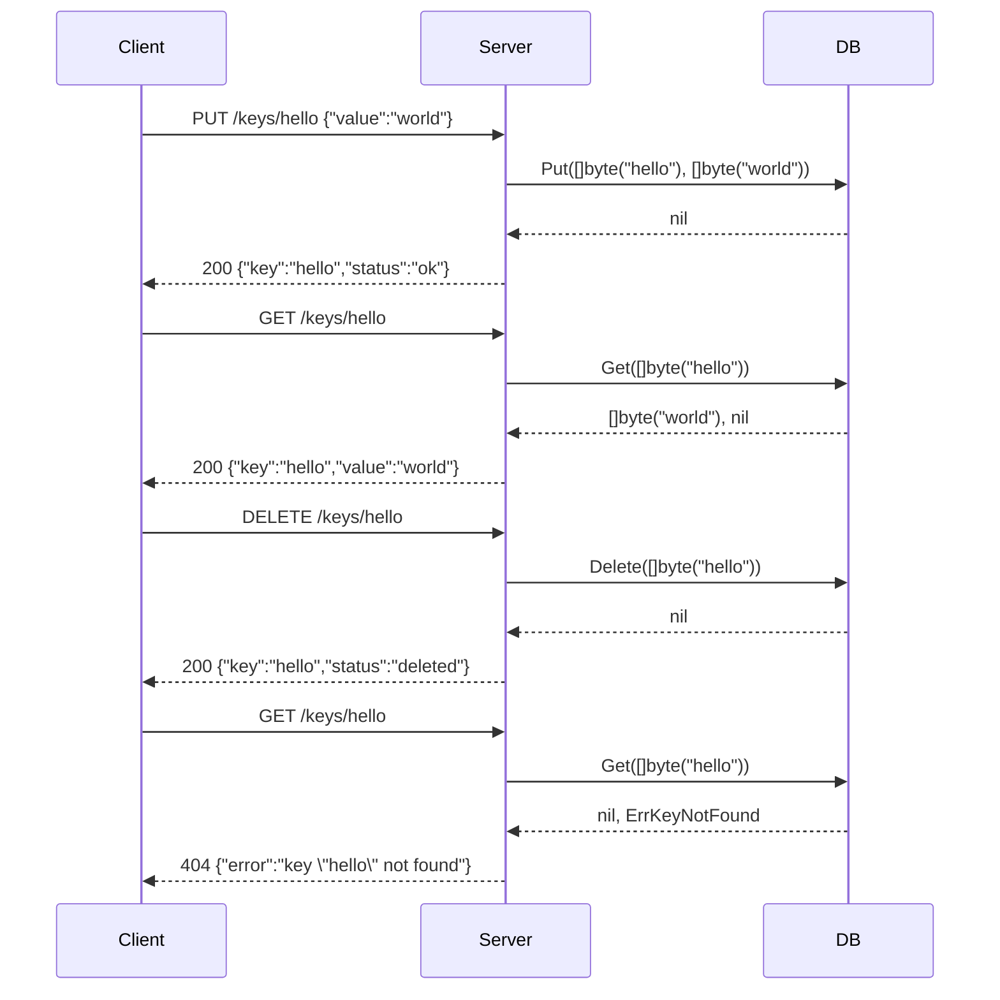

# Server

The `cmd/server` package is the HTTP entrypoint for `keyradb`. It exposes the LSM engine (`internal/db`) over a RESTful API and has zero knowledge of internal storage details.

## SOLID Responsibilities

| Principle | Applied here |
|---|---|
| **S** | The server owns only one concern: translating HTTP requests into `db.DB` calls and HTTP responses. Serialisation helpers (`writeJSON`, `httpError`) are extracted into dedicated functions. |
| **O** | New endpoints can be added by registering additional handlers without touching existing ones. |
| **L** | Each handler is a standalone `http.HandlerFunc` — they are composable and independently testable. |
| **I** | The server interacts with `db.DB` through only five methods (`Put`, `Get`, `Delete`, `Flush`, `Close`). It has no visibility into WAL, Memtable, or SSTable internals. |
| **D** | The server depends on `db.DB` (an abstraction), not on any specific storage implementation. Swapping the engine requires only a change to `Open`. |

## REST API

Base URL: `http://localhost:6380`

All request and response bodies are JSON. All responses include a `Content-Type: application/json` header.

---

### `GET /keys/{key}`

Retrieves the value stored at `key`.

**Path parameters**

| Parameter | Type | Description |
|---|---|---|
| `key` | string | The key to look up. |

**Responses**

| Status | Body | Condition |
|---|---|---|
| `200 OK` | `{ "key": "...", "value": "..." }` | Key found. |
| `404 Not Found` | `{ "error": "key \"...\" not found" }` | Key does not exist. |
| `500 Internal Server Error` | `{ "error": "..." }` | Storage layer failure. |

**Example**

```bash
curl http://localhost:6380/keys/hello
# 200 OK
# {"key":"hello","value":"world"}
```

---

### `PUT /keys/{key}`

Inserts or updates a key with the given value.

**Path parameters**

| Parameter | Type | Description |
|---|---|---|
| `key` | string | The key to write. |

**Request body**

```json
{ "value": "string" }
```

**Responses**

| Status | Body | Condition |
|---|---|---|
| `200 OK` | `{ "key": "...", "status": "ok" }` | Write succeeded. |
| `400 Bad Request` | `{ "error": "invalid JSON body: ..." }` | Malformed request body. |
| `500 Internal Server Error` | `{ "error": "..." }` | Storage layer failure. |

**Example**

```bash
curl -X PUT http://localhost:6380/keys/hello \
     -H "Content-Type: application/json" \
     -d '{"value":"world"}'
# 200 OK
# {"key":"hello","status":"ok"}
```

---

### `DELETE /keys/{key}`

Marks a key as deleted (tombstone). A subsequent `GET` for the same key returns `404`.

**Path parameters**

| Parameter | Type | Description |
|---|---|---|
| `key` | string | The key to delete. |

**Responses**

| Status | Body | Condition |
|---|---|---|
| `200 OK` | `{ "key": "...", "status": "deleted" }` | Tombstone written. |
| `500 Internal Server Error` | `{ "error": "..." }` | Storage layer failure. |

**Example**

```bash
curl -X DELETE http://localhost:6380/keys/hello
# 200 OK
# {"key":"hello","status":"deleted"}
```

---

### `POST /flush`

Forces the active Memtable to be written to a new SSTable immediately, regardless of its current size.

**Responses**

| Status | Body | Condition |
|---|---|---|
| `200 OK` | `{ "status": "flushed" }` | Flush succeeded. |
| `500 Internal Server Error` | `{ "error": "..." }` | Flush failed. |

**Example**

```bash
curl -X POST http://localhost:6380/flush
# 200 OK
# {"status":"flushed"}
```

---

### `GET /health`

Liveness check. Returns immediately without touching storage.

**Responses**

| Status | Body |
|---|---|
| `200 OK` | `{ "status": "ok" }` |

**Example**

```bash
curl http://localhost:6380/health
# 200 OK
# {"status":"ok"}
```

---

## CLI Flags

```
-addr   string   HTTP listen address (default ":6380")
-data   string   Directory for database files (default "./data")
-mem-mb int      Memtable flush threshold in MiB (default 4)
```

## Running

```bash
go run ./cmd/server/ -addr :6380 -data ./data -mem-mb 4
```

## Request / Response Flow


