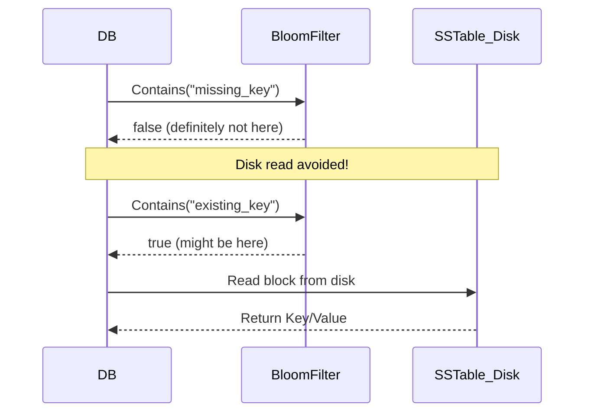
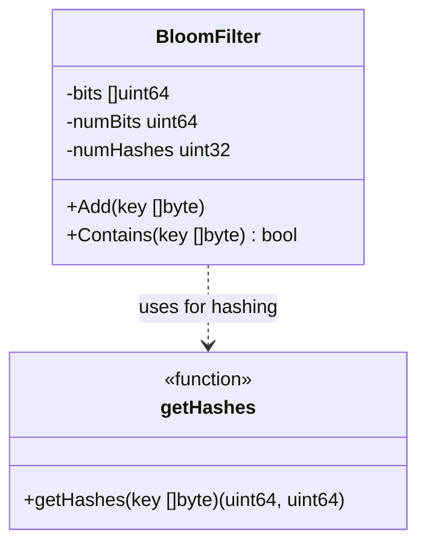

# BloomFilter Module

The `bloomfilter` module provides a memory-efficient, probabilistic data structure designed to quickly test whether an element is a member of a set. In an LSM-tree database like `keyradb`, it is heavily utilized to prevent expensive disk I/O operations when searching for keys that do not exist.

## Why and When to Use
- **Why**: Disk reads are slow. A Bloom Filter can tell us definitively if a key is *not* present. It can also tell us if a key *might* be present.
- **When**: It is primarily attached to SSTables (Sorted String Tables). Before checking the Sparse Index or loading an SSTable block from disk, the DB queries the Bloom Filter.

## Types & Methods

### `type BloomFilter struct`
The core structure holding the filter state.
- **`bits []uint64`**: The bit array packed into 64-bit integers for efficiency.
- **`numBits uint64`**: Total number of bits in the filter.
- **`numHashes uint32`**: Number of hash functions applied per key.

### `func NewBloomFilter(numBits uint64, numHashes uint32) *BloomFilter`
- **Functioning**: Initializes the bit array allocating exactly enough `uint64` elements to cover `numBits` (i.e. `(numBits+63)/64`).

### `func getHashes(key []byte) (uint64, uint64)`
- **Functioning**: Calculates two independent 32-bit hashes from a single 64-bit `xxhash` execution. 
- **Why**: Using the "double hashing" technique, we can simulate `k` hash functions efficiently (`h = h1 + i * h2`).

### `func (bf *BloomFilter) Add(key []byte)`
- **Functioning**: Hashes the key, generates `numHashes` positions using double hashing, and sets the corresponding bits to `1` in the `bits` array.

### `func (bf *BloomFilter) Contains(key []byte) bool`
- **Functioning**: Generates the same hash positions for the key. If *any* of those bits are `0`, the key is definitely not in the set (returns `false`). If all are `1`, it might be present (returns `true`).

## Architectural Diagram

