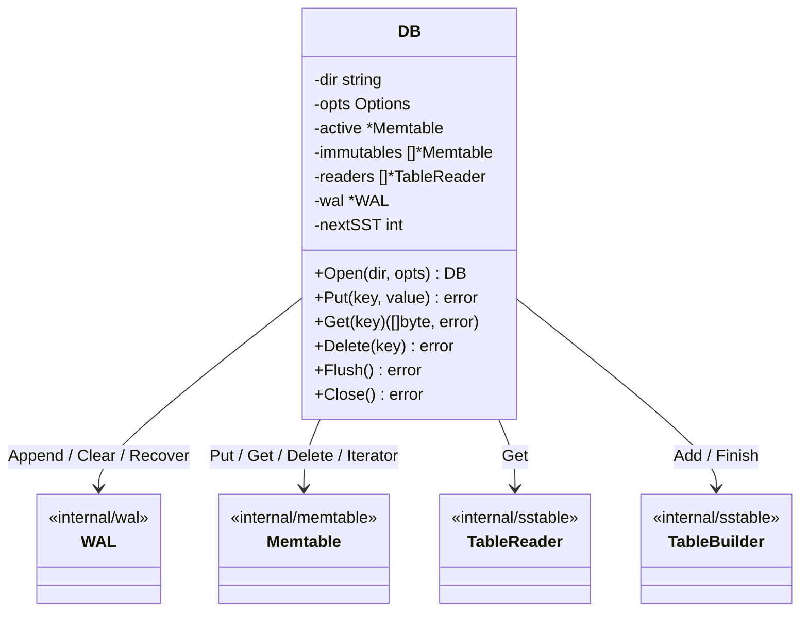
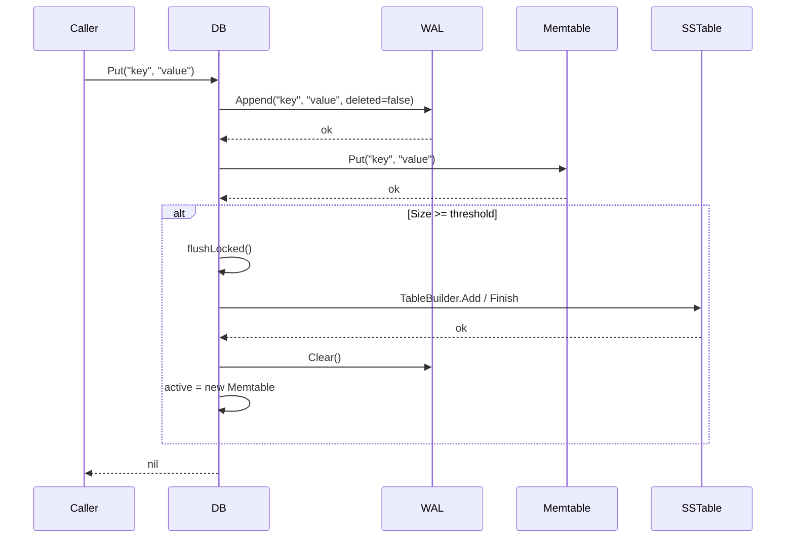
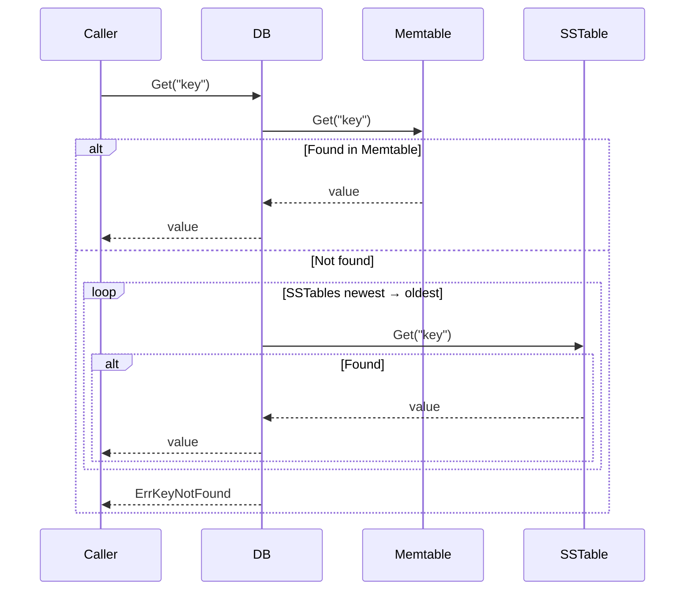
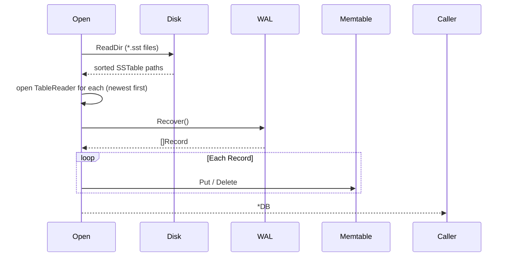

# DB Module

The `db` module is the LSM engine for `keyradb`. It orchestrates the Write-Ahead Log, Memtable, and SSTables into a single durable, concurrent key-value store.

## Why and When to Use

- **Why**: Individual components (WAL, Memtable, SSTable) are useful in isolation but have no coordination. `db` provides that coordination layer — deciding when to flush, how to recover, and in which order to query storage levels.
- **When**: All reads and writes from the server flow through this package. It is the only package the server imports.

## SOLID Responsibilities

| Principle | Applied here |
|---|---|
| **S** | `db` does only one thing: coordinate the storage levels. It does not implement serialisation, hashing, or file I/O directly. |
| **O** | `Options` allows the flush threshold and other settings to be changed by the caller without modifying engine code. |
| **L** | `TableReader` and `TableBuilder` are consumed through their own types — `db` never constructs a reader from a builder. |
| **I** | The exported surface is limited to `Open`, `Put`, `Get`, `Delete`, `Flush`, and `Close`. All internal coordination (`flushLocked`, `loadSSTables`, `recover`) is unexported. |
| **D** | `db` depends on the abstract behaviour of `memtable.Memtable`, `wal.WAL`, and `sstable.TableReader`/`TableBuilder` — not on their implementation details. |

## Core Types & Methods

### `type Options struct`

| Field | Type | Default | Description |
|---|---|---|---|
| `MemtableMaxBytes` | `int64` | `4 MiB` | Flush threshold. When the active memtable reaches this size it is written to a new SSTable. |

### `func Open(dir string, opts Options) (*DB, error)`

Opens or creates the database at `dir`. On open it:
1. Creates the directory if it does not exist.
2. Opens the WAL (`wal.log`).
3. Scans the directory for existing SSTable files and opens a `TableReader` for each, ordered newest-first.
4. Replays the WAL into the active Memtable to recover any writes that were not yet flushed.

### `func (db *DB) Put(key, value []byte) error`

1. Appends the operation to the WAL (durability guarantee).
2. Inserts the key-value pair into the active Memtable.
3. Triggers `flushLocked` if `Memtable.Size() ≥ MemtableMaxBytes`.

### `func (db *DB) Get(key []byte) ([]byte, error)`

Queries storage levels in order, newest to oldest, and returns on first hit:
1. Active Memtable.
2. Immutable Memtables (newest first).
3. SSTables (newest first).

Returns `ErrKeyNotFound` if the key is absent across all levels.

### `func (db *DB) Delete(key []byte) error`

Writes a tombstone. Identical flow to `Put` but records the entry as deleted. The tombstone masks the key on reads until compaction removes it.

### `func (db *DB) Flush() error`

Forces the active Memtable to disk regardless of size. Used by the server's `/flush` endpoint.

### `func (db *DB) Close() error`

Flushes the active Memtable, closes all SSTable readers, and closes the WAL.

## Architectural Diagrams

### Components

### Write Path

### Read Path

### Startup & Recovery

## Error Reference

| Error | Meaning |
|---|---|
| `ErrKeyNotFound` | The key does not exist at any storage level. |
| `ErrClosed` | An operation was attempted on a closed database. |
