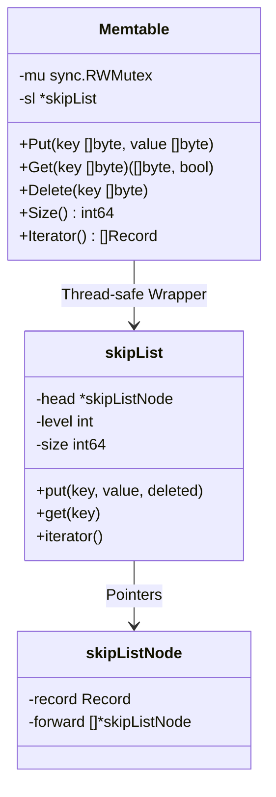
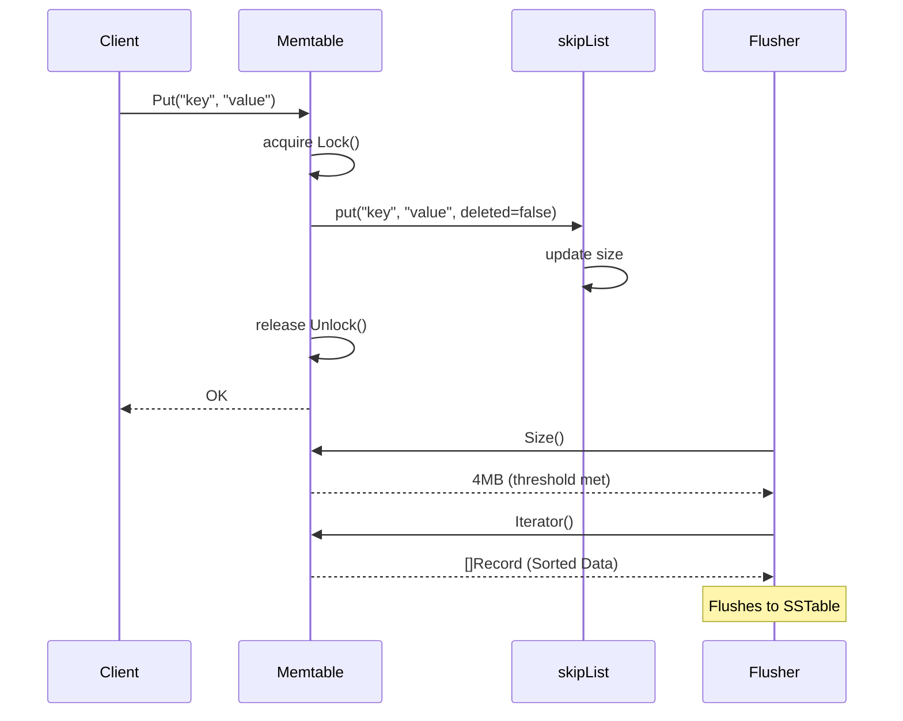

# Memtable Module

The `memtable` module implements the in-memory write buffer for the `keyradb` LSM tree. It acts as the staging area for all `Put` and `Delete` operations before they are flushed to disk.

## Why and When to Use
- **Why**: Disk writes are slow, especially if they are random. A Memtable absorbs random writes into memory, keeping them sorted. This allows the database to eventually write them sequentially to disk as an SSTable.
- **When**: Every write/delete goes here first. Every read queries the Memtable first because it holds the most recent state.

## Core Types & Methods

### Thread-Safe Wrapper

#### `type Memtable struct`
The public thread-safe LSM component.
- **`mu sync.RWMutex`**: Guarantees thread safety for concurrent access.
- **`sl *skipList`**: The underlying data structure.

- **`New() *Memtable`**: Initializes the memtable.
- **`Put(key, value []byte)`**: Thread-safe insert/update. Copies bytes to prevent mutation.
- **`Get(key []byte) ([]byte, bool)`**: Thread-safe lookup. Returns a copy of the value.
- **`Delete(key []byte)`**: Inserts a Tombstone (a `Record` where `Deleted = true`).
- **`Size() int64`**: Returns exact byte size of keys and values. Used to trigger SSTable flushes.
- **`Iterator() []Record`**: Returns the sorted dataset for the flush process.

### Internal Data Structure (SkipList)

#### `type skipList struct`
A probabilistic linked-list alternative to balanced trees, offering O(log N) operations.
- **`head *skipListNode`**: The entry point, featuring max-level pointers.
- **`level int`**: The current highest level of the skip list.
- **`size int64`**: Tracked byte size.

#### `type skipListNode struct`
- **`record Record`**: Holds the Key, Value, and Tombstone flag.
- **`forward []*skipListNode`**: The slice of pointers pointing to the next node at various levels.

#### `func (sl *skipList) randomLevel() int`
- **Functioning**: Uses a probability constant (`0.25`) to randomly decide how "tall" a new node should be.

#### `func (sl *skipList) put/get/iterator`
- **Functioning**: The unsafe core algorithms traversing the forward pointers via binary-search-like jumps.

## Architectural Diagrams

### Components

### Flow

