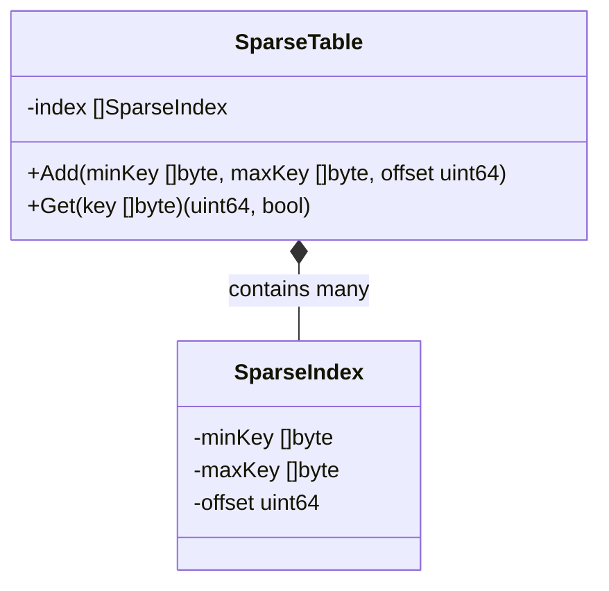
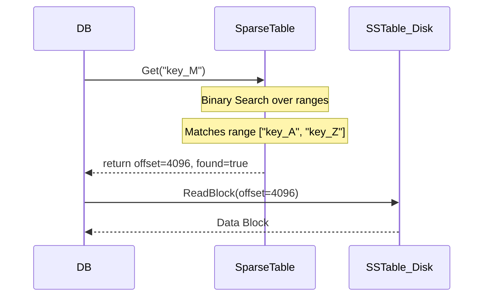

# SparseTable Module

The `sparsetable` module provides an in-memory indexing mechanism for mapping key ranges to physical disk offsets. It acts as the bridge between the high-level key lookup and the physical SSTable blocks on disk.

## Why and When to Use
- **Why**: Storing an exact index of every key in memory is too expensive. A sparse index only stores the boundaries (`minKey` and `maxKey`) of a data block.
- **When**: Used during the reading phase of an SSTable. Once the Bloom Filter indicates a key might exist, the DB checks the `SparseTable` to find exactly which byte offset on disk it needs to read.

## Types & Methods

### `type SparseIndex struct`
Represents a single block's metadata.
- **`minKey []byte`**: The smallest key in the block.
- **`maxKey []byte`**: The largest key in the block.
- **`offset uint64`**: The physical byte offset where this block begins on disk.

### `type SparseTable struct`
The collection of all block indexes.
- **`index []SparseIndex`**: A slice of `SparseIndex` sorted sequentially by keys.

### `func NewSparseTable() *SparseTable`
- **Functioning**: Initializes an empty `SparseTable`.

### `func (st *SparseTable) Add(minKey, maxKey []byte, offset uint64)`
- **Functioning**: Deep copies the `minKey` and `maxKey` to prevent upstream mutations, and appends a new `SparseIndex` entry to the table.
- **Where Used**: Called when the `TableBuilder` finishes writing a data block and needs to record its location.

### `func (st *SparseTable) Get(key []byte) (uint64, bool)`
- **Functioning**: Performs an O(log N) Binary Search over the `index` array. If the target `key` falls between an entry's `minKey` and `maxKey`, it returns the corresponding `offset`.

## Architectural Diagram

