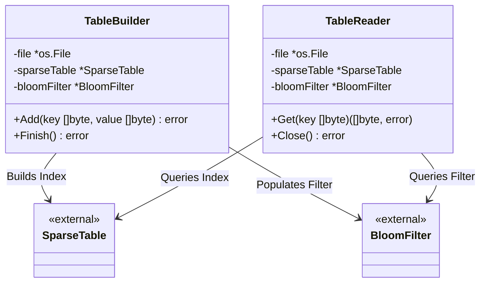
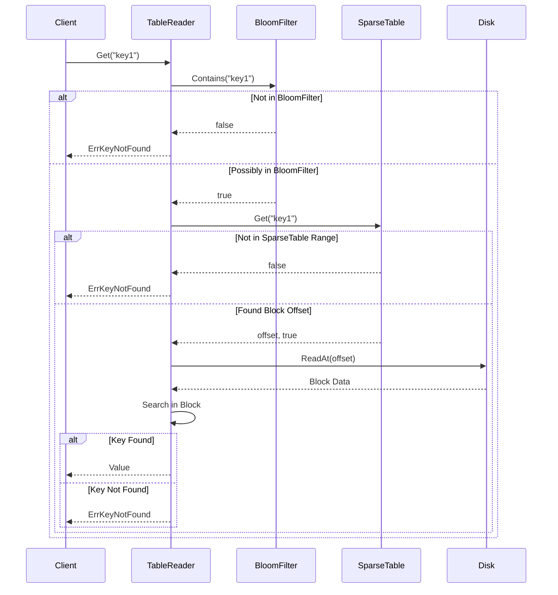

# SSTable Module

The `sstable` (Sorted String Table) module implements the immutable, disk-backed storage component for the `keyradb` LSM tree. It handles writing sorted key-value pairs to disk and efficiently reading them back using a combination of a Bloom Filter and a Sparse Table (index).

## Why and When to Use
- **Why**: Storing all data in memory (Memtable) is volatile and expensive. SSTables provide a persistent, highly structured, and efficiently searchable on-disk format. They allow range queries and quick point-lookups without loading the entire dataset into memory.
- **When**: 
  - **Writing**: Used when a Memtable becomes full and needs to be flushed to disk, or during the compaction process when merging multiple existing SSTables.
  - **Reading**: Used when a `Get` request cannot find a key in the Memtable. The database will query SSTables, starting from the most recent.

## Core Types & Methods

### TableReader

#### `type TableReader struct`
Responsible for efficiently retrieving values from an existing SSTable file.
- **`file *os.File`**: The underlying file handle.
- **`sparseTable *sparsetable.SparseTable`**: In-memory index to quickly locate the block containing a key.
- **`bloomFilter *bloomfilter.BloomFilter`**: Probabilistic data structure to quickly determine if a key is *not* in the table.
- **`mu sync.RWMutex`**: Guarantees thread safety for concurrent read access.

- **`NewTableReader(path string) (*TableReader, error)`**: Opens the file, reads the footer, and deserializes the Bloom Filter and Sparse Table into memory.
- **`Get(key []byte) ([]byte, error)`**: Looks up a key. Returns `ErrKeyNotFound` if the key doesn't exist. It leverages the Bloom Filter first, then the Sparse Table to find the block, and finally performs a linear search within the block.
- **`Close() error`**: Closes the underlying file descriptor.

### TableBuilder

#### `type TableBuilder struct`
Responsible for constructing a new SSTable file from a sequence of strictly sorted key-value pairs.
- **`file *os.File`**: The underlying file handle for writing.
- **`sparseTable *sparsetable.SparseTable`**: Builds the block index as data is written.
- **`bloomFilter *bloomfilter.BloomFilter`**: Populated with every key added.
- **`currentBlock bytes.Buffer`**: Buffers data before flushing to disk when `BlockSize` is reached.

- **`NewTableBuilder(path string, expectedKeyCount uint64) (*TableBuilder, error)`**: Initializes a new builder with an estimated key count to properly size the Bloom Filter.
- **`Add(key []byte, value []byte) error`**: Appends a key-value pair. Keys *must* be added in strictly increasing order.
- **`Finish() error`**: Flushes any remaining block data, serializes and appends the Bloom Filter and Sparse Table, writes the footer, and syncs/closes the file.

## File Format

An SSTable on disk is structured as follows:

1. **Data Blocks**: Sequence of blocks, each ~4KB. 
   - Block format: `[Length (4 bytes)][Header (6 bytes)][Key][Value]...`
2. **Bloom Filter**: Serialized Bloom Filter data.
3. **Sparse Table**: Serialized Sparse Table index data.
4. **Footer (40 bytes)**:
   - `[Bloom Filter Offset (8 bytes)]`
   - `[Bloom Filter Size (8 bytes)]`
   - `[Sparse Table Offset (8 bytes)]`
   - `[Sparse Table Size (8 bytes)]`
   - `[Magic Number (8 bytes)]`

## Architectural Diagrams

### Components

### Flow (Read / Get)

