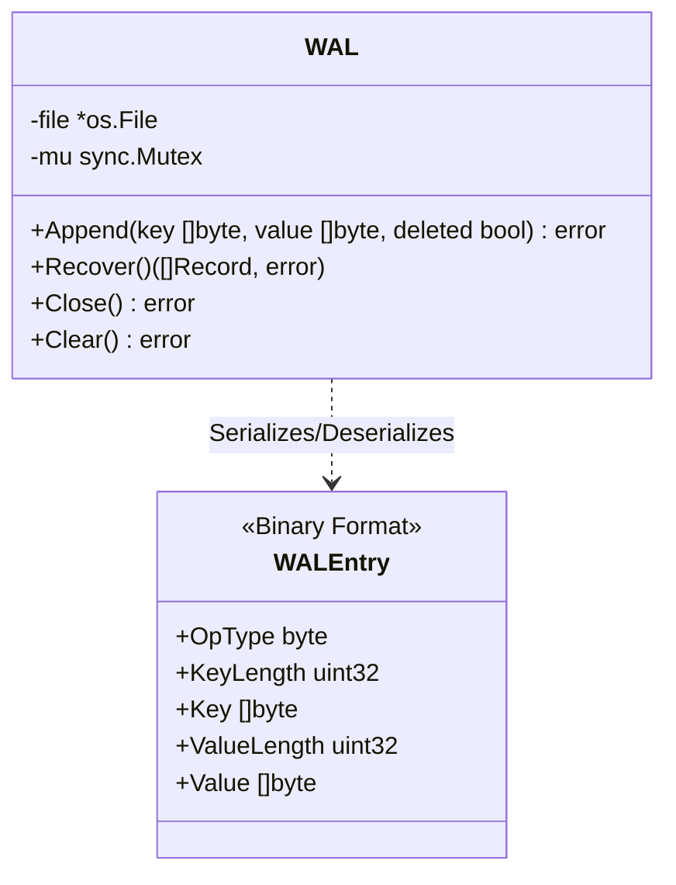
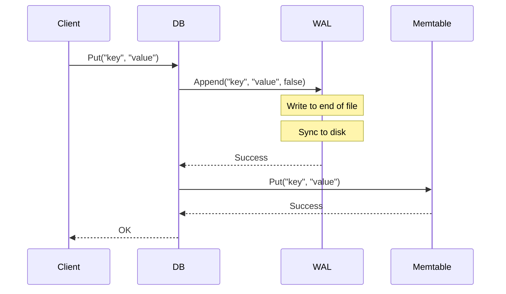
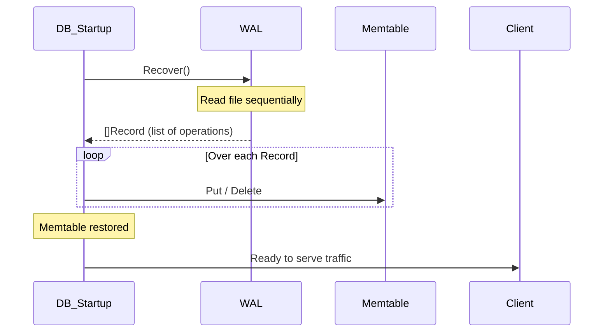

# Write-Ahead Log (WAL) Module

The `wal` module provides durability and crash recovery for the `keyradb` LSM tree. While the `Memtable` buffers writes in memory for speed, the WAL safely persists those writes to an append-only log file on disk before acknowledging success to the client.

## Why and When to Use
- **Why**: Memory is volatile. If the server crashes, any data residing solely in the `Memtable` is permanently lost. The WAL guarantees that written data survives crashes.
- **When**: 
  - **Write Path**: Every `Put` or `Delete` operation must be appended to the WAL *before* it is inserted into the `Memtable`.
  - **Recovery**: Upon database startup, the DB reads the WAL to reconstruct the `Memtable` state that wasn't flushed to an SSTable prior to the shutdown/crash.

## Proposed Core Types & Methods

### `type WAL struct`
Manages the append-only log file on disk.
- **`file *os.File`**: The active file descriptor for the log.
- **`mu sync.Mutex`**: Ensures thread-safe sequential writes.

### `func NewWAL(path string) (*WAL, error)`
- **Functioning**: Opens or creates the log file in append-only mode.

### `func (w *WAL) Append(key []byte, value []byte, deleted bool) error`
- **Functioning**: Serializes the operation (Key, Value, and Tombstone flag) into a binary format and writes it sequentially to the end of the file. Optionally calls `fsync()` for strict durability guarantees.
- **Where Used**: Called immediately upon receiving a write request from the user.

### `func (w *WAL) Recover() ([]Record, error)`
- **Functioning**: Reads the file sequentially from start to finish, deserializing operations into `Record` objects so the database can replay them into the `Memtable`.
- **Where Used**: Called only during the initialization phase of the database.

## Architectural Diagrams

### Components

### Write Path Flow

### Crash Recovery Flow

